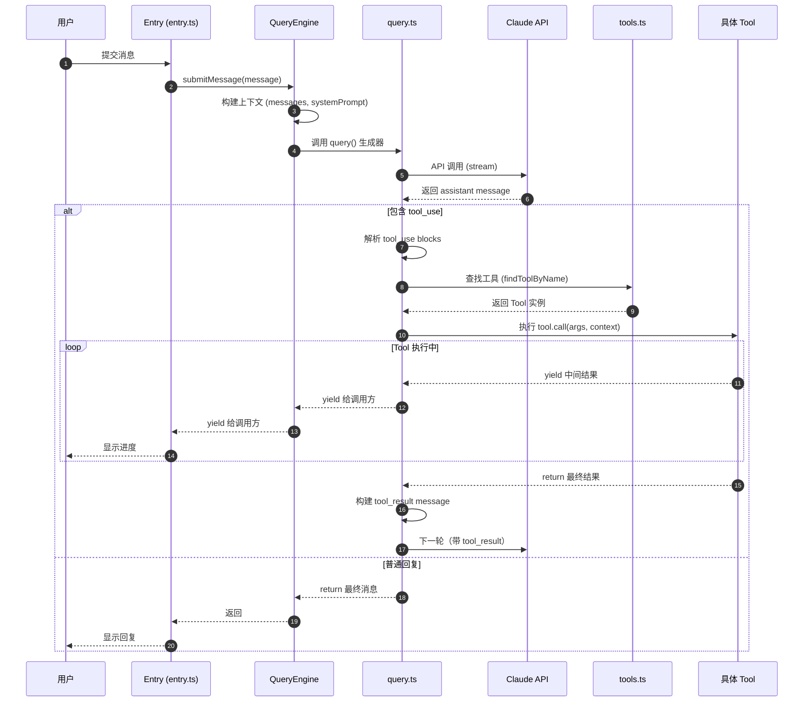
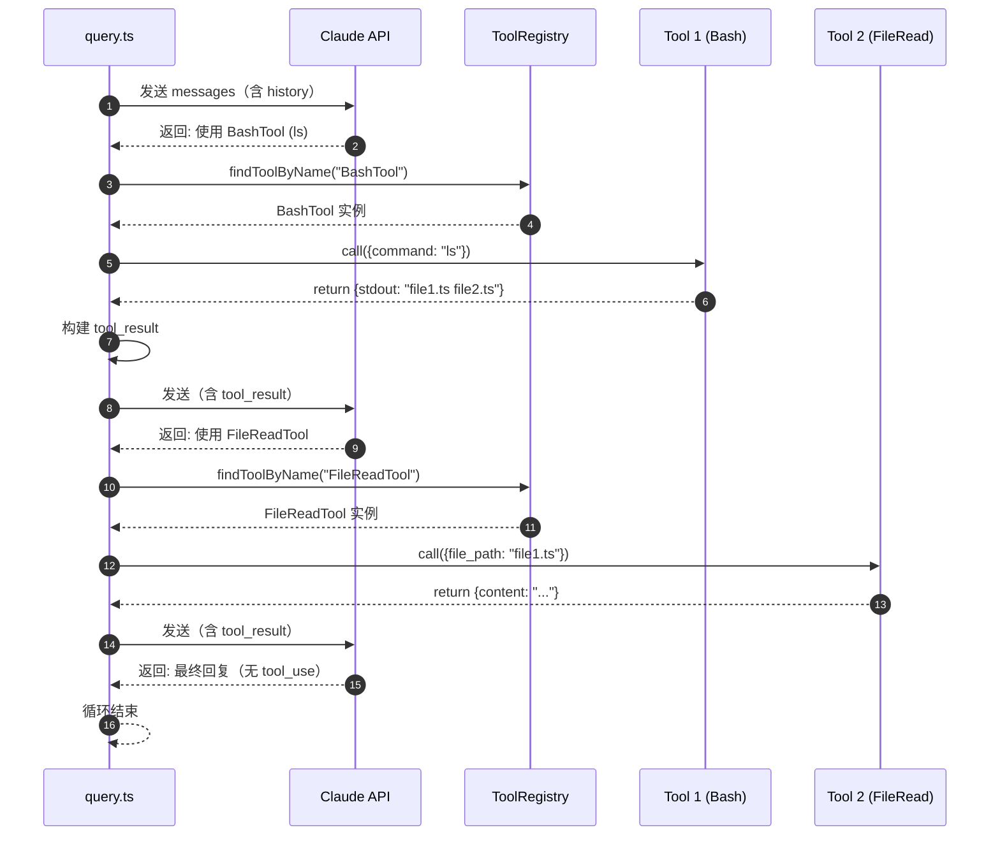
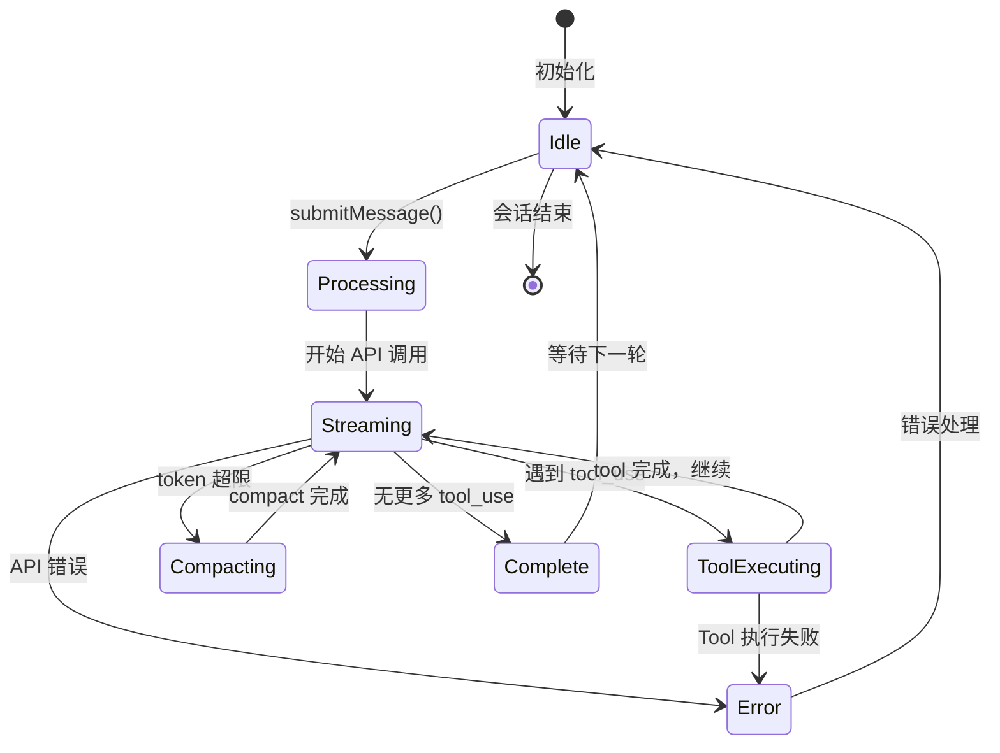

# Claude Code Vision —— 架构评审与 Tool-Call 时序分析

## 1. 文档信息

- **创建日期**: 2026-05-12
- **对应 Sprint**: Sprint 0 (S0-1)
- **文档目的**: 分析精简后的 `src/` 架构，绘制 tool-call 时序图，为视觉中台融合提供基础

---

## 2. 核心架构概览

### 2.1 目录结构（精简后保留 26 个 Tools）

```
src/
├── QueryEngine.ts          # 46K 行 —— 核心引擎，管理对话生命周期
├── query.ts                # query 执行循环，处理流式响应
├── Tool.ts                 # Tool 类型定义与接口
├── tools.ts                # Tool 注册表，getAllBaseTools()
├── commands.ts             # Command 注册表
├── tools/                  # 26 个保留的 Tool 实现
│   ├── BashTool/           # shell 命令执行
│   ├── FileReadTool/       # 文件读取（已支持图片/PDF）
│   ├── FileEditTool/       # 文件编辑
│   ├── FileWriteTool/      # 文件写入
│   ├── GlobTool/           # 文件搜索
│   ├── GrepTool/           # 文本搜索
│   ├── WebFetchTool/       # 网页获取
│   ├── WebSearchTool/      # 网络搜索
│   ├── AgentTool/          # 子 Agent 派生
│   ├── SkillTool/          # Skill 调用
│   ├── MCPTool/            # MCP 服务器调用
│   ├── LSPTool/            # LSP 支持
│   ├── NotebookEditTool/   # Notebook 编辑
│   ├── TodoWriteTool/      # 任务列表
│   ├── Task*Tool/          # 任务管理（Create/Get/List/Update/Stop/Output）
│   ├── EnterPlanModeTool/  # 进入计划模式
│   └── ...（其他工具）
└── commands/               # 24 个保留的 Command
```

### 2.2 核心类型定义（Tool.ts）

```typescript
// Tool 基础接口
export type Tool = {
  name: string
  description: string
  inputJSONSchema: ToolInputJSONSchema
  async *call(
    args: unknown,
    context: ToolUseContext,
    toolUse: ToolUseBlockParam
  ): AsyncGenerator<YieldResult, ReturnResult>
  isEnabled?(): boolean
  userFacingName?(): string
  getCost?(): number
}
```

---

## 3. Tool-Call 时序图

### 3.1 标准单轮对话时序



### 3.2 多轮 Tool-Call 循环（复杂查询）



### 3.3 QueryEngine 内部状态流转



---

## 4. Tool 注册与发现机制

### 4.1 Tool 注册流程

```typescript
// tools.ts - getAllBaseTools() 函数
export function getAllBaseTools(): Tools {
  return [
    AgentTool,
    TaskOutputTool,
    BashTool,
    FileReadTool,
    FileEditTool,
    FileWriteTool,
    GlobTool,
    GrepTool,
    WebFetchTool,
    WebSearchTool,
    // ... 其他工具
  ].filter(tool => tool.isEnabled?.() ?? true)  // 过滤禁用工具
}

// QueryEngine 初始化时传入 tools
const engine = new QueryEngine({
  tools: getAllBaseTools(),
  commands: getCommands(),
  // ... 其他配置
})
```

### 4.2 Tool 查找逻辑（Tool.ts）

```typescript
export function findToolByName(
  tools: readonly Tool[],
  name: string
): Tool | undefined {
  return tools.find(t => toolMatchesName(t, name))
}

export function toolMatchesName(tool: Tool, name: string): boolean {
  if (tool.name === name) return true
  if (tool.aliases?.includes(name)) return true
  return false
}
```

---

## 5. 视觉融合接入点分析

### 5.1 现有图像处理能力

`FileReadTool` 已具备基础图像处理能力：
- 使用 `sharp` 库压缩图像到 token 限制内
- 将图像转为 base64 传递给 Claude
- 支持 PDF 转图片处理

**局限**:
- 仅被动响应（用户/Tool 主动传入图片）
- 无本地 VLM 处理
- 无屏幕级 Computer Use 能力

### 5.2 推荐的视觉 Tool 接入位置

```typescript
// 新增视觉 Tool 家族将按相同模式注册
// src/tools/vision/ScreenshotTool.ts
// src/tools/vision/BrowserVisionTool.ts
// src/tools/vision/VisionQATool.ts
// ...

// 在 tools.ts 的 getAllBaseTools() 中添加
import { ScreenshotTool } from './vision/ScreenshotTool'
import { BrowserVisionTool } from './vision/BrowserVisionTool'
// ...

export function getAllBaseTools(): Tools {
  return [
    // ... 现有工具
    ScreenshotTool,
    BrowserVisionTool,
    // ... 其他视觉工具
  ]
}
```

### 5.3 与 Python Sidecar 的通信点

视觉 Tool 将通过 `src/vision/sidecar.ts` 与 Python sidecar 通信：

```typescript
// 每个视觉 Tool 的 call() 方法内部
async *call(args, context) {
  // 1. 调用 sidecar RPC
  const result = await sidecar.call('vlm.caption', {
    image_path: args.image_path,
    model: 'minicpm-v-2.6'
  })
  
  // 2. yield 进度
  yield { type: 'progress', message: '正在分析图像...' }
  
  // 3. return 结果
  return { 
    content: result.text,
    confidence: result.confidence 
  }
}
```

---

## 6. 关键数据流总结

| 阶段 | 数据流 | 核心文件 |
|------|--------|----------|
| 初始化 | Entry → QueryEngine | `entry.ts`, `QueryEngine.ts` |
| 消息提交 | QueryEngine.submitMessage() | `QueryEngine.ts` |
| Query 执行 | query.ts 生成器循环 | `query.ts` |
| Tool 调用 | query.ts → Tool.call() | `Tool.ts`, 各 Tool 目录 |
| Tool 注册 | tools.ts getAllBaseTools() | `tools.ts` |
| 流式返回 | Tool → query → QueryEngine → Entry | 全链路 yield |

---

## 7. 风险与注意事项

1. **循环依赖**: `tools.ts` 与部分 Tool 之间存在懒加载（lazy require）打破循环
2. **Feature Flags**: 大量使用 `feature()` 条件编译，测试时需确保对应 flag 开启
3. **Import 红线**: `main.tsx` 仍引用已删除模块，但不影响新 `entry.ts` 的使用
4. **权限检查**: 每个 Tool 调用前需经过 `canUseTool` 检查（Permission 系统）

---

## 8. 下一步工作（Sprint 1+）

基于本文档，后续 Sprint 将：
1. 创建 `src/vision/` 目录结构
2. 实现 `src/vision/sidecar.ts` RPC 客户端
3. 创建 `vision_sidecar/` Python 包
4. 实现首批视觉 Tool（VisionQATool, ScreenshotTool）
5. 集成 Hybrid Vision Router
