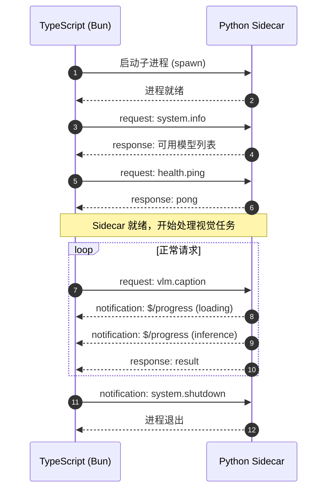

# Vision Sidecar 通信协议规范

## 1. 文档信息

- **创建日期**: 2026-05-12
- **对应 Sprint**: Sprint 0 (S0-3)
- **协议版本**: v1.0
- **设计参考**: LSP (Language Server Protocol) + JSON-RPC 2.0

---

## 2. 设计原则

1. **stdio 传输**: TypeScript 主进程通过 stdin/stdout 与 Python sidecar 通信（避免端口冲突）
2. **消息边界**: 使用 `Content-Length` 头部（LSP 风格）解决粘包问题
3. **异步响应**: 支持乱序响应（通过 `id` 字段匹配）
4. **流式输出**: 支持 `yield` 风格的分块返回（用于长时间运行的视觉任务）

---

## 3. 消息格式

### 3.1 基础格式

每条消息包含头部和 JSON 主体：

```
Content-Length: <长度>\r\n
\r\n
<JSON 主体>
```

### 3.2 Request（TypeScript → Python）

```json
{
  "jsonrpc": "2.0",
  "id": "req-123",
  "method": "vlm.caption",
  "params": {
    "image_path": "/tmp/screenshot.png",
    "model": "minicpm-v-2.6",
    "prompt": "describe this image",
    "max_tokens": 256
  }
}
```

### 3.3 Success Response（Python → TypeScript）

```json
{
  "jsonrpc": "2.0",
  "id": "req-123",
  "result": {
    "text": "This is a screenshot of a web application...",
    "confidence": 0.92,
    "model": "minicpm-v-2.6",
    "latency_ms": 312,
    "tokens": {
      "input": 1024,
      "output": 128
    }
  }
}
```

### 3.4 Error Response

```json
{
  "jsonrpc": "2.0",
  "id": "req-123",
  "error": {
    "code": -32602,
    "message": "Invalid params",
    "data": {
      "field": "image_path",
      "issue": "file not found"
    }
  }
}
```

### 3.5 Progress Notification（Python → TypeScript，流式）

```json
{
  "jsonrpc": "2.0",
  "method": "$/progress",
  "params": {
    "id": "req-123",
    "stage": "loading_model",
    "message": "Loading MiniCPM-V model...",
    "percent": 25
  }
}
```

### 3.6 Notification（TypeScript → Python，无需响应）

```json
{
  "jsonrpc": "2.0",
  "method": "system.shutdown",
  "params": {}
}
```

---

## 4. 标准错误码

| 错误码 | 含义 | 场景 |
|--------|------|------|
| -32700 | Parse error | JSON 解析失败 |
| -32600 | Invalid Request | 请求格式错误 |
| -32601 | Method not found | 未知方法 |
| -32602 | Invalid params | 参数校验失败 |
| -32603 | Internal error | 服务器内部错误 |
| -32000 | Model not loaded | 模型未加载 |
| -32001 | Model load failed | 模型加载失败 |
| -32002 | Inference timeout | 推理超时 |
| -32003 | GPU OOM | 显存不足 |

---

## 5. 方法清单（Sprint 规划）

### 5.1 Sprint 1 方法

| 方法 | 描述 | 输入 | 输出 |
|------|------|------|------|
| `vlm.caption` | 图像描述 | `image_path`, `model` | `text`, `confidence` |
| `vlm.query` | 视觉问答 | `image_path`, `question`, `model` | `answer`, `confidence` |
| `vlm.detect` | 目标检测 | `image_path`, `target` | `boxes[]` |
| `detect.yolo` | YOLO 检测 | `image_path`, `classes` | `detections[]` |
| `health.ping` | 健康检查 | - | `pong` |
| `system.info` | 系统信息 | - | `models`, `gpu_info` |

### 5.2 Sprint 2 方法

| 方法 | 描述 | 输入 | 输出 |
|------|------|------|------|
| `ocr.extract` | OCR 文字识别 | `image_path` | `text_blocks[]` |
| `image.diff` | 图像对比 | `image_a`, `image_b` | `score`, `diff_map` |
| `image.annotate` | 图像标注 | `image_path`, `boxes[]` | `annotated_path` |

### 5.3 Sprint 3 方法

| 方法 | 描述 | 输入 | 输出 |
|------|------|------|------|
| `ui.parse` | UI 元素解析 | `image_path` | `elements[]` |
| `gui.click` | 模拟点击 | `x`, `y` | `success` |
| `gui.type` | 模拟输入 | `text` | `success` |
| `gui.screenshot` | 屏幕截图 | - | `image_path` |

### 5.4 Sprint 4 方法

| 方法 | 描述 | 输入 | 输出 |
|------|------|------|------|
| `embed.image` | 图像嵌入 | `image_path` | `embedding[]` |
| `embed.text` | 文本嵌入 | `text` | `embedding[]` |
| `rag.search` | 向量搜索 | `query`, `top_k` | `results[]` |

---

## 6. TypeScript 客户端接口设计

```typescript
// src/vision/sidecar.ts

export interface SidecarRequest {
  id: string
  method: string
  params: Record<string, unknown>
}

export interface SidecarResponse {
  id: string
  result?: unknown
  error?: {
    code: number
    message: string
    data?: unknown
  }
}

export class VisionSidecar {
  private process: ChildProcess
  private pendingRequests: Map<string, Deferred<SidecarResponse>>
  private messageBuffer: string = ''
  
  constructor(sidecarPath: string) {
    // 启动 Python sidecar 进程
  }
  
  async call<T = unknown>(
    method: string, 
    params: Record<string, unknown>,
    timeout?: number
  ): Promise<T> {
    // 发送请求并等待响应
  }
  
  async *callStream<T>(
    method: string,
    params: Record<string, unknown>
  ): AsyncGenerator<T> {
    // 流式调用，支持 progress notification
  }
  
  async shutdown(): Promise<void> {
    // 优雅关闭
  }
}
```

---

## 7. Python 服务端框架

```python
# vision_sidecar/vision_sidecar/server.py

import asyncio
import json
import sys
from typing import Any, Callable
from dataclasses import dataclass

@dataclass
class Request:
    id: str
    method: str
    params: dict

@dataclass
class Response:
    id: str
    result: Any = None
    error: dict = None

class SidecarServer:
    def __init__(self):
        self.methods: dict[str, Callable] = {}
        
    def register(self, method: str, handler: Callable):
        """注册 RPC 方法"""
        self.methods[method] = handler
        
    async def handle_request(self, request: Request) -> Response:
        """处理单个请求"""
        handler = self.methods.get(request.method)
        if not handler:
            return Response(
                id=request.id,
                error={"code": -32601, "message": f"Method '{request.method}' not found"}
            )
        
        try:
            result = await handler(**request.params)
            return Response(id=request.id, result=result)
        except Exception as e:
            return Response(
                id=request.id,
                error={"code": -32603, "message": str(e)}
            )
    
    async def run(self):
        """主循环：从 stdin 读取，向 stdout 写入"""
        while True:
            message = await self._read_message()
            if message is None:
                break
                
            request = self._parse_request(message)
            response = await self.handle_request(request)
            await self._write_response(response)
    
    async def _read_message(self) -> str | None:
        """读取 LSP 格式消息"""
        # 读取 Content-Length 头部
        # 读取 JSON body
        pass
    
    async def _write_response(self, response: Response):
        """写入 LSP 格式响应"""
        json_str = json.dumps({
            "jsonrpc": "2.0",
            "id": response.id,
            **({"result": response.result} if response.result else {}),
            **({"error": response.error} if response.error else {})
        })
        sys.stdout.write(f"Content-Length: {len(json_str)}\r\n\r\n{json_str}")
        sys.stdout.flush()
```

---

## 8. 启动流程



---

## 9. 超时与重试策略

| 场景 | 超时时间 | 重试策略 |
|------|----------|----------|
| 健康检查 | 5s | 不重试，失败即重启 sidecar |
| 快速 VLM (Moondream) | 30s | 重试 1 次，失败降级 |
| 慢速 VLM (MiniCPM-V) | 120s | 重试 1 次，失败降级 |
| 模型加载 | 300s | 重试 2 次，失败报错 |
| GUI 操作 | 10s | 不重试 |

---

## 10. 版本协商

```json
// 初始化时版本协商
{
  "jsonrpc": "2.0",
  "id": "init-1",
  "method": "system.initialize",
  "params": {
    "protocol_version": "1.0",
    "client": {
      "name": "coderetina",
      "version": "0.1.0"
    }
  }
}

// 响应
{
  "jsonrpc": "2.0",
  "id": "init-1",
  "result": {
    "protocol_version": "1.0",
    "server": {
      "name": "vision-sidecar",
      "version": "0.1.0"
    },
    "capabilities": {
      "models": ["moondream2", "minicpm-v-2.6"],
      "streaming": true
    }
  }
}
```

---

## 11. 示例代码

### 11.1 TypeScript 完整调用示例

```typescript
import { VisionSidecar } from './vision/sidecar'

const sidecar = new VisionSidecar('./vision_sidecar/run.py')
await sidecar.initialize()

// 简单调用
const result = await sidecar.call('vlm.caption', {
  image_path: '/tmp/test.png',
  model: 'moondream2'
})
console.log(result.text)

// 流式调用（带进度）
for await (const chunk of sidecar.callStream('vlm.caption', params)) {
  if (chunk.type === 'progress') {
    console.log(`进度: ${chunk.percent}%`)
  } else if (chunk.type === 'result') {
    console.log(`结果: ${chunk.text}`)
  }
}

await sidecar.shutdown()
```

### 11.2 Python 服务端完整示例

```python
# vision_sidecar/run.py
import asyncio
from vision_sidecar.server import SidecarServer
from vision_sidecar.methods.vlm import VLMHandler

async def main():
    server = SidecarServer()
    vlm = VLMHandler()
    
    # 注册方法
    server.register('system.initialize', lambda **kw: {"ok": True})
    server.register('health.ping', lambda: "pong")
    server.register('vlm.caption', vlm.caption)
    server.register('vlm.query', vlm.query)
    
    print("Sidecar ready", file=sys.stderr)
    await server.run()

if __name__ == "__main__":
    asyncio.run(main())
```

---

## 12. 附录：与 LSP 的差异

| 特性 | LSP | 本协议 |
|------|-----|--------|
| 传输 | stdio / socket / pipe | 仅 stdio |
| 通知 | 双向 | 双向 |
| 取消 | `$/cancelRequest` | 暂未实现 |
| 批量 | 支持 | 暂未支持 |
| 进度 | `$/progress` | 复用 LSP 格式 |

---

**文档结束** —— 本协议为 Sprint 0 产出，Sprint 1-4 可能按需扩展。
